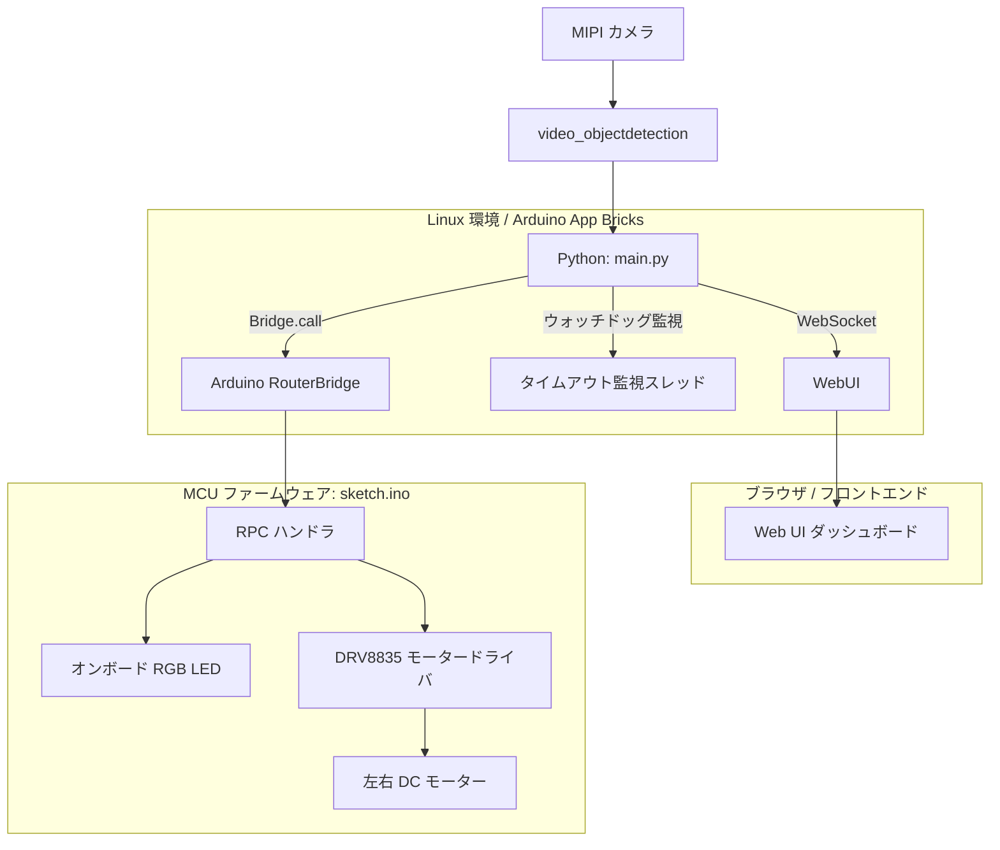

# Uno Q ロボットカー (Uno Q Robot Car)

**Uno Q ロボットカー**は、メディアキャリアボードに接続されたMIPIカメラのリアルタイム映像から物体を検出し、DRV8835モータードライバを介してロボットを自律走行させるプロジェクトです。

カメラの視野内に物体が検出されている間は前進し、物体が外れて検知が途切れると自動的に停止（安全タイムアウト）します。検出状況や確信度はWeb UIブラウザ上からリアルタイムにモニタリング・設定変更が可能です。

Arduino App Labのインスピレーションにある`Detect Objects on Camera`のプロジェクトにモーター制御のスケッチを追加してBridgeで連携したものです。


 
## 主な特徴

- **デュアルコア協調動作**: Linux側（Python）で重いAI物体検出を行い、MCU側（C++）でリアルタイムなモーターPWM制御とLEDインジケータを担当
- **低電圧駆動対応 (DRV8835)**: DRV8835を採用することで、単3電池×2本（約2.4V〜3.0V）でも電圧降下を起こさず安定してDCモーターを駆動可能
- **Arduino_RouterBridge (RPC通信)**: Linux-MCU間のプロセス間通信により、最小限の遅延で制御信号を伝達
- **自動停止機構（ウォッチドッグ）**: 物体が画面外へ外れた際にコールバックが途絶えても、設定時間（0.5秒）で自動停止するフェイルセーフを実装
- **RGB LEDステータス表示**: 車体上のRGB LEDで走行（赤点灯）／停止（消灯）の状態を視覚的に把握可能

## システム構成図



## 使用している Brick

- web_ui: 検出結果のリアルタイム表示および検出閾値スライダーを提供するWebフロントエンド。
- video_objectdetection: MIPIカメラからの映像ストリームに対してリアルタイム物体検出を行うAI推論エンジン。
- Bridge (Arduino_RouterBridge): LinuxコアとMCUコア間でRPC関数呼び出しを行う通信インターフェース。

## ハードウェア要件

### 必要機材

- メインボード: [Arduino UNO Q](https://akizukidenshi.com/catalog/g/g131696/) (x1)
- 拡張ボード: [Arduino Media Carrier ボード](https://www.switch-science.com/products/11135) (x1)
- カメラ: [MIPI CSI カメラモジュール](https://akizukidenshi.com/catalog/g/g117368/) (x1)
- モータードライバ: [DRV8835使用ステッピング&DCモータードライバーモジュール](https://akizukidenshi.com/catalog/g/g109848/) (x1)
- 駆動系: DCギアモーター ＆ 車輪 （[ロボットシャーシ](https://akizukidenshi.com/catalog/g/g113651/)に含まれます）
- モーター電源: 単3形乾電池 × 2本（[電池ボックス](https://akizukidenshi.com/catalog/g/g100327/)付き、約3.0V）
- マイコン電源: USB モバイルバッテリー（5V USB-C給電）
- ロボットシャーシ: [2WD Mini Smart Robot Mobile Platform Kit for education](https://akizukidenshi.com/catalog/g/g113651/)
- 小型ブレッドボード
- ジャンパーワイヤ
- USB-Cケーブル
- インターネット接続可能なPC

### 配線表 (DRV8835 接続)

| DRV8835ピン| 接続先 | 説明 |
|:---:|:---:|:---:|
| VM | 単3電池 (+) | モーター電源（約3V）|
| AOUT1 | モーターA(+) | 左輪モーター |
| AOUT2 | モーターA(-) | 左輪モーター |
| BOUT1 | モーターB(+) | 右輪モーター |
| BOUT2 | モーターB(-) | 右輪モーター |
| GND | 単3電池 (-) ＆ Uno Q GND | 共通グラウンド（必ず共通接続）|
| VCC | Uno Q 3.3V | ロジック電源 |
| MODE | GND | IN/INモード（常時GNDに接続）|
| AIN1 | Uno Q D3 (PWM) | 左モーター 前進 |
| AIN2 | Uno Q D9 (PWM) | 左モーター 後退 |
| BIN1 | Uno Q D10 (PWM) | 右モーター 前進 |
| BIN2 | Uno Q D11 (PWM) | 右モーター 後退 |

>DRV8835の特長: DRV8835はモーター電源電圧の下限が0V（モータースペックに依存）のため、充電式ニッケル水素電池（1.2V×2本 = 2.4V）や消耗しかけた乾電池でも安定して回転を維持できます。

## プロジェクト構成

- main.py: 物体検出、Web UI通信、タイムアウト監視、MCUへのRPCコマンド送信を行うPythonスクリプト
- sketch.ino: RPC経由でコマンドを受け取り、DRV8835のPWMピンおよびRGB LEDを制御するMCUスケッチ
- index.html / app.js: ブラウザ用Web UI（カメラ映像ストリーミング、検出履歴、確信度スライダー）

## 使い方・動作手順

### 1. 配線と組み立て

- MIPIカメラをMedia CarrierのCSIコネクタに確実に接続します。
- 上記配線表に従い、DRV8835、単3電池ボックス、DCモーターを配線します。
- 安全のため、最初は車輪を机から浮かせた状態でテストしてください。

### 2. 電源投入

- モバイルバッテリーをメインボードのUSB-Cポートに接続します。

### 3. スケッチの書き込みとアプリ起動

- Arduino App Lab から sketch.ino をMCUに書き込みます。
- 画面上部の実行ボタンから main.py を起動します。

### 4. Web UIの確認

- ブラウザが自動的に開くか、<ボード名>.local:7000 に手動でアクセスします。
- リアルタイムカメラ映像と検出ログが表示されることを確認します。

### 5. 動作確認

- カメラの前に物をかざすと、RGB LEDが赤く点灯し、車輪が前進方向に回転します。
- 物をカメラの前から外すと、約0.5秒後に自動停止し、LEDが消灯します。

## コアロジックの解説

### 1. タイムアウト付き検出監視 (main.py)

物体が検出された瞬間のみコールバックが発火する仕様に対応するため、バックグラウンドスレッドで検知途絶を監視し、一定時間（0.5秒）検出が途切れたら安全に停止します。

```Python
# 0.5秒間検知が途切れたら停止と判定
TIMEOUT_SEC = 0.5

def watchdog_loop():
    global last_detection_time, current_state
    while True:
        if current_state == 1 and (time.time() - last_detection_time > TIMEOUT_SEC):
            update_motor(0)
        time.sleep(0.05)

def send_detections_to_ui(detections: dict):
    global last_detection_time
    total_detected = sum(len(items) for items in detections.values())
    
    if total_detected > 0:
        last_detection_time = time.time()
        update_motor(1)
```

### 2. RPCによるモーター制御 (sketch.ino)

Python側からの bridge.call("motor_state", state) を受け取り、即座にPWM出力とLEDの点灯状態を切り替えます。

```C++
String rpc_motor_state(int state) {
  if (state > 0) {
    moveForward();
  } else {
    stopMotors();
  }
  return "{\"ok\":true}";
}
```